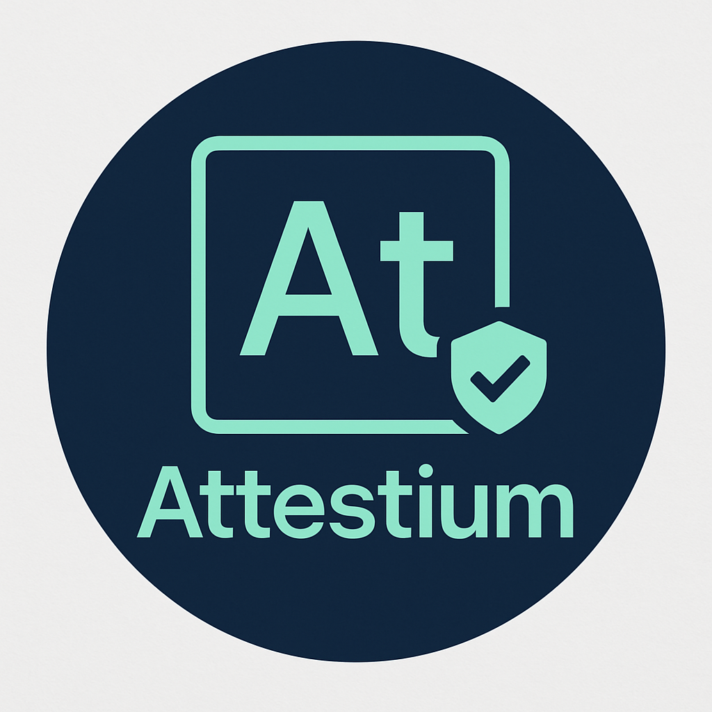

# Attestium



[](https://github.com/attestium/attestium/actions)
[](https://badge.fury.io/js/attestium)
[](https://opensource.org/licenses/MIT)
[](https://nodejs.org/)
[](https://github.com/attestium/attestium/actions)
[](https://trustedcomputinggroup.org/)

> **Element of Attestation** - Runtime code verification and integrity monitoring for Node.js applications

## 🧪 **What is Attestium?**

Attestium is a **runtime code verification and integrity monitoring library** that provides cryptographic proof of your application's code integrity. Like an element in the periodic table, Attestium represents the fundamental building block of **attestation** - the ability to prove that your code is running exactly as intended, without tampering or modification.

### **Core Concept: Element of Attestation**

Just as chemical elements have unique properties and atomic structures, Attestium provides:
- **Symbol**: `At` (for Attestation)
- **Atomic Properties**: Stable verification states, tamper-reactive bonds
- **Chemical Reactions**: Cryptographic verification processes
- **Molecular Structure**: File checksums linked by cryptographic bonds

## 🎯 **Why Attestium Exists**

### **The Problem: Trust in Distributed Systems**

In today's world of cloud computing and distributed systems, users need to trust that:
- The code running on servers matches what's published in repositories
- No unauthorized modifications have been made to running applications
- Third parties can independently verify system integrity
- Changes to code are immediately detectable

### **Research Background**

Attestium was developed based on extensive research into existing solutions and their limitations. This research was inspired by:

- **[Forward Email Technical Whitepaper](https://forwardemail.net/technical-whitepaper.pdf)** - Requirements for transparent, auditable email infrastructure
- **[Mullvad System Transparency](https://mullvad.net/media/system-transparency-rev4.pdf)** - Approaches to system transparency and verification

> [!NOTE]
> **Research Foundation**: Attestium addresses the specific need for runtime code verification that emerged from Forward Email's commitment to transparency and Mullvad's pioneering work in system transparency.

## 🔍 **Comprehensive Analysis of Existing Solutions**

Before developing Attestium, we conducted extensive research into existing verification, attestation, and integrity monitoring solutions. This comprehensive analysis examines 20+ solutions across different categories to understand their capabilities, limitations, and suitability for runtime code verification.

| **Solution** | **Primary Purpose** | **Runtime Verification** | **Third-Party APIs** | **Hardware Requirements** | **Complexity** | **Cost** | **Node.js Integration** | **Application Focus** | **Continuous Monitoring** | **Description** | **Notes** |
|----------|----------|---------------------|------------------|-------------------|---------------------|------|-------------------|------------------|---------------------|-------------|-------|
| **[Attestium](https://github.com/forwardemail/attestium)** | Runtime Verification | ✅ Yes | ✅ Yes | ✅ TPM 2.0 Optional | 🟢 Low | 🟢 Free | ✅ Native | ✅ Yes | ✅ Yes ([Audit Status](https://auditstatus.com)) | Hardware-backed runtime code verification for Node.js applications with TPM 2.0 integration | Our solution - addresses gaps in existing tools with hardware security |
| **[SigSum](https://www.sigsum.org/)** | Transparency Logging | ❌ No | ✅ Yes | ❌ No | 🟡 Medium | 🟢 Free | ❌ No | ❌ No | ⚠️ Log Only | Minimal design for public transparency logs of signed checksums with witness verification | Excellent for transparency but no runtime verification |
| **[SigStore](https://www.sigstore.dev/)** | Code Signing | ❌ No | ⚠️ Limited | ❌ No | 🟡 Medium | 🟢 Free | ⚠️ Limited | ❌ No | ❌ No | Keyless code signing for software supply chain security with transparency logs | Build-time signing only, no runtime capabilities |
| **[Keylime](https://keylime.dev/)** | Remote Attestation | ⚠️ Limited | ✅ Yes | ✅ TPM Required | 🔴 High | 🟢 Free | ❌ No | ⚠️ Limited | ⚠️ Limited | Remote attestation framework using TPM for hardware-backed verification | Infrastructure-focused, requires specialized hardware |
| **[Intel TXT](https://www.intel.com/content/www/us/en/support/articles/000025873/technologies.html)** | Hardware Attestation | ❌ No | ⚠️ Limited | ✅ Intel CPU | 🔴 High | 🟡 Hardware | ❌ No | ⚠️ Boot Only | ❌ No | Hardware-based platform attestation with measured boot process | Boot-time only, no application-level verification |
| **[AMD SVM](https://developer.amd.com/sev/)** | Hardware Attestation | ❌ No | ⚠️ Limited | ✅ AMD CPU | 🔴 High | 🟡 Hardware | ❌ No | ⚠️ Boot Only | ❌ No | Hardware virtualization security with memory encryption | Limited to virtualization security |
| **[ARM TrustZone](https://www.arm.com/technologies/trustzone-for-cortex-a)** | Hardware Attestation | ⚠️ Limited | ⚠️ Limited | ✅ ARM CPU | 🔴 High | 🟡 Hardware | ❌ No | ⚠️ Limited | ❌ No | Hardware security architecture with secure/non-secure worlds | ARM-specific, complex development |
| **[Intel SGX](https://www.intel.com/content/www/us/en/developer/tools/software-guard-extensions/overview.html)** | Secure Enclaves | ⚠️ Enclave Only | ⚠️ Limited | ✅ Intel CPU | 🔴 High | 🟡 Hardware | ❌ No | ⚠️ Enclave Only | ⚠️ Limited | Secure enclaves for protected code execution with remote attestation | Being deprecated, limited memory |
| **[AWS Nitro Enclaves](https://aws.amazon.com/ec2/nitro/nitro-enclaves/)** | Cloud Attestation | ⚠️ Limited | ⚠️ Limited | ✅ AWS Only | 🟡 Medium | 🔴 Expensive | ❌ No | ⚠️ Limited | ❌ No | Isolated compute environments with cryptographic attestation | AWS-only, expensive for continuous use |
| **[Google Asylo](https://asylo.dev/)** | Secure Enclaves | ⚠️ Enclave Only | ⚠️ Limited | ✅ SGX/TrustZone | 🔴 High | 🟢 Free | ❌ No | ⚠️ Enclave Only | ❌ No | Framework for confidential computing across multiple TEE technologies | Complex development, limited ecosystem |
| **[Microsoft VBS](https://docs.microsoft.com/en-us/windows-hardware/design/device-experiences/oem-vbs)** | Virtualization Security | ⚠️ Limited | ❌ No | ✅ Windows Only | 🟡 Medium | 🟡 Windows | ❌ No | ⚠️ Limited | ❌ No | Windows security using hypervisor isolation for code integrity | Windows-only, limited cross-platform support |
| **[Docker Content Trust](https://docs.docker.com/engine/security/trust/)** | Container Signing | ❌ No | ❌ No | ❌ No | 🟡 Medium | 🟢 Free | ❌ No | ❌ No | ❌ No | Container image signing and verification with role-based delegation | Container-focused, no runtime verification |
| **[Notary](https://github.com/notaryproject/notary)** | Content Signing | ❌ No | ⚠️ Limited | ❌ No | 🟡 Medium | 🟢 Free | ❌ No | ❌ No | ❌ No | Framework for publishing and managing trusted collections of content | Generic signing, no application-specific features |
| **[Cosign](https://github.com/sigstore/cosign)** | Container Signing | ❌ No | ⚠️ Limited | ❌ No | 🟡 Medium | 🟢 Free | ❌ No | ❌ No | ❌ No | Container signing with keyless signatures using OIDC | Container-focused, part of SigStore ecosystem |
| **[in-toto](https://in-toto.io/)** | Supply Chain Security | ❌ No | ⚠️ Limited | ❌ No | 🟡 Medium | 🟢 Free | ❌ No | ❌ No | ❌ No | Framework for securing software supply chains with cryptographic evidence | Build-time verification, complex policy definition |
| **[SLSA](https://slsa.dev/)** | Supply Chain Framework | ❌ No | ❌ No | ❌ No | 🟡 Medium | 🟢 Free | ❌ No | ❌ No | ❌ No | Framework for supply chain integrity with security levels | Framework only, requires implementation |
| **[Grafeas](https://grafeas.io/)** | Metadata API | ❌ No | ✅ Yes | ❌ No | 🟡 Medium | 🟢 Free | ❌ No | ❌ No | ❌ No | Metadata API for software supply chain with vulnerability tracking | Metadata storage only, no verification |
| **[Binary Authorization](https://cloud.google.com/binary-authorization)** | Policy Enforcement | ❌ No | ⚠️ Limited | ❌ No | 🟡 Medium | 🟡 GCP | ❌ No | ❌ No | ❌ No | Deploy-time security policy enforcement for container images | GCP-specific, deployment-time only |
| **[AIDE](https://aide.github.io/)** | File Integrity | ⚠️ Files Only | ❌ No | ❌ No | 🟢 Low | 🟢 Free | ❌ No | ⚠️ Files Only | ⚠️ Scheduled | Advanced intrusion detection with file integrity monitoring | File-level only, no runtime code verification |
| **[Tripwire](https://www.tripwire.com/)** | File Integrity | ⚠️ Files Only | ❌ No | ❌ No | 🟡 Medium | 🔴 Commercial | ❌ No | ⚠️ Files Only | ⚠️ Scheduled | Commercial file integrity monitoring with enterprise features | Commercial licensing, file-level monitoring |
| **[OSSEC](https://www.ossec.net/)** | Security Monitoring | ⚠️ Files Only | ⚠️ Limited | ❌ No | 🟡 Medium | 🟢 Free | ❌ No | ⚠️ Files Only | ⚠️ Limited | Host-based intrusion detection with file integrity checking | Security-focused, not verification-focused |
| **[Samhain](https://www.la-samhna.de/samhain/)** | File Integrity | ⚠️ Files Only | ❌ No | ❌ No | 🟡 Medium | 🟢 Free | ❌ No | ⚠️ Files Only | ⚠️ Scheduled | File integrity monitoring with stealth capabilities | File-level only, scheduled checks |
| **[AFICK](http://afick.sourceforge.net/)** | File Integrity | ⚠️ Files Only | ❌ No | ❌ No | 🟢 Low | 🟢 Free | ❌ No | ⚠️ Files Only | ❌ No | Another file integrity checker with simple configuration | Basic file monitoring, no API |
| **[Chainlink](https://chain.link/)** | Blockchain Oracles | ❌ No | ✅ Yes | ❌ No | 🔴 High | 🔴 Expensive | ❌ No | ❌ No | ❌ No | Decentralized oracle network for external data verification | High cost, high latency, no code verification |
| **[Ethereum Attestations](https://ethereum.org/en/developers/docs/data-and-analytics/block-explorers/)** | Blockchain | ❌ No | ✅ Yes | ❌ No | 🔴 High | 🔴 Gas Fees | ❌ No | ❌ No | ❌ No | On-chain attestation protocols with immutable audit trails | High gas costs, environmental concerns |
| **[Hyperledger Fabric](https://www.hyperledger.org/use/fabric)** | Blockchain | ❌ No | ✅ Yes | ❌ No | 🔴 High | 🟡 Infrastructure | ❌ No | ❌ No | ❌ No | Enterprise blockchain platform with permissioned networks | Complex infrastructure, no application focus |

### **Why Existing Solutions Weren't Sufficient**

Based on our comprehensive analysis, we identified critical gaps that existing solutions couldn't address for our specific requirements:

#### **1. Runtime Application Verification Gap**
- **Problem**: Most solutions focus on build-time, deployment-time, or infrastructure-level verification
- **Impact**: Cannot detect runtime tampering or code injection attacks
- **Attestium Solution**: Continuous runtime monitoring with real-time verification

#### **2. Third-Party Verification API Gap**
- **Problem**: Existing solutions lack standardized APIs for external verification
- **Impact**: Difficult for auditors to independently verify system integrity
- **Attestium Solution**: RESTful APIs with nonce-based challenge-response protocols

#### **3. Developer Experience Gap**
- **Problem**: Hardware-based solutions require specialized knowledge and infrastructure
- **Impact**: High barrier to adoption for typical web applications
- **Attestium Solution**: Simple npm package with minimal configuration

#### **4. Node.js Ecosystem Gap**
- **Problem**: Most solutions are language-agnostic or focused on other platforms
- **Impact**: Poor integration with Node.js applications and workflows
- **Attestium Solution**: Native Node.js integration with runtime hooks

#### **5. Cost and Complexity Gap**
- **Problem**: Enterprise solutions are expensive; hardware solutions are complex
- **Impact**: Unsuitable for many applications and organizations
- **Attestium Solution**: Free, open-source, software-only implementation

#### **6. Granular Monitoring Gap**
- **Problem**: File integrity tools monitor files; application tools monitor performance
- **Impact**: No solution provides granular application code verification
- **Attestium Solution**: File categorization with application-aware monitoring

#### **7. Continuous Verification Gap**
- **Problem**: Most solutions provide point-in-time verification
- **Impact**: Cannot detect tampering between verification intervals
- **Attestium Solution**: Continuous background verification with configurable intervals

## 🧪 **Attestium's Unique Approach**

Attestium addresses these gaps by providing:

### **✅ Runtime Code Verification**
- Continuous monitoring of running application code
- Real-time detection of unauthorized modifications
- In-memory integrity checking capabilities

### **✅ Third-Party Verification APIs**
- RESTful APIs for external verification
- Nonce-based challenge-response protocols
- Cryptographically signed verification reports

### **✅ Developer-Friendly Design**
- Simple npm package installation
- Minimal configuration requirements
- Integration with existing Node.js applications

### **✅ Granular File Categorization**
- Intelligent categorization of source code, tests, configuration, and dependencies
- Customizable include/exclude patterns
- Git integration for baseline establishment

### **✅ Cryptographic Proof Generation**
- SHA-256 checksums for all monitored files
- Signed verification reports
- Tamper-evident audit trails

### **✅ Modern Workflow Integration**
- Git commit hash tracking
- CI/CD pipeline integration
- Cosmiconfig-based configuration management

## 🔒 **Tamper-Proofing and Security Considerations**

### **The Challenge of Runtime Tampering**

One of the most significant challenges in software verification is preventing runtime tampering - the ability for malicious actors to modify code in memory after it has been loaded and verified. Traditional approaches like `Object.freeze()` and VM isolation provide some protection, but determined attackers with system access can potentially bypass these mechanisms.

### **Attestium's Multi-Layered Defense**

Attestium employs several innovative approaches to address runtime tampering:

#### **1. Tamper-Resistant Memory Protection**
- **VM-Based Isolation**: Critical verification logic runs in isolated VM contexts
- **Proxy Protection**: Function interception prevents runtime modification of verification methods
- **Original Function Capture**: Core JavaScript functions are captured before they can be overridden

#### **2. External Validation Network**
- **GitHub Release Verification**: Compares local code against signed GitHub releases
- **Multi-Source Validation**: Cross-references multiple trusted external sources
- **Distributed Challenge System**: External services provide unpredictable validation challenges

#### **3. Continuous Integrity Monitoring**
- **Real-Time Checksums**: Continuous validation of file and memory integrity
- **Behavioral Analysis**: Monitors for suspicious modification patterns
- **Audit Trail**: Tamper-evident logging of all verification activities
- **[Audit Status Integration](https://auditstatus.com)**: Enterprise-grade continuous monitoring with automated server auditing, webhook notifications, and TPM-backed verification

### **Limitations and Considerations**

While Attestium provides significant protection against tampering, it's important to understand the fundamental limitations of software-only solutions:

#### **The Verification Paradox**
- **Core Challenge**: How do you prove integrity when an attacker controls the verification system?
- **Mitigation**: External validation and distributed verification reduce single points of failure
- **Reality**: Perfect tamper-proofing may require hardware-based solutions (TPM, HSM, etc.)

#### **Practical Security Model**
Attestium is designed to:
- ✅ **Detect casual tampering** and unauthorized modifications
- ✅ **Raise the bar significantly** for sophisticated attacks
- ✅ **Provide audit trails** for forensic analysis
- ✅ **Enable external verification** by independent parties
- ⚠️ **Cannot prevent** determined attackers with root access and unlimited time

### **Best Practices for Maximum Security**

1. **Deploy in Controlled Environments**: Use containers, restricted user accounts, and access controls
2. **Enable External Monitoring**: Set up independent verification nodes
3. **Regular Baseline Updates**: Keep verification baselines current with legitimate changes
4. **Combine with Other Security Measures**: Use alongside firewalls, intrusion detection, and access logging
5. **Monitor Verification APIs**: Watch for unusual patterns in verification requests

## 🔐 **TPM 2.0 Hardware-Backed Security**

### **Why TPM 2.0 is Critical for Attestium**

Attestium **requires TPM 2.0** for production deployments where maximum security is needed. While Attestium can operate in software-only mode for development and testing, **TPM 2.0 integration is essential** for addressing the fundamental limitations of software-only verification systems.

> [!IMPORTANT]
> **TPM 2.0 Requirement**: For production environments handling sensitive data or requiring regulatory compliance, Attestium **must** be deployed with TPM 2.0 hardware support. Software-only mode should only be used for development, testing, or non-critical applications.

### **The Fundamental Problem: Software-Only Verification Limits**

#### **Attack Vectors Possible Without TPM 2.0**

When running in software-only mode, Attestium is vulnerable to several sophisticated attack vectors:

1. **Root-Level Memory Manipulation**
   - Attackers with root access can directly modify process memory
   - Critical verification functions can be overwritten in RAM
   - Cryptographic keys stored in software can be extracted

2. **Hypervisor-Level Attacks**
   - Virtual machine introspection can bypass software protections
   - VM memory can be paused, modified, and resumed
   - Host-level attackers can manipulate guest verification processes

3. **Time-of-Check vs Time-of-Use (TOCTOU) Attacks**
   - Files can be modified between verification and execution
   - Verification results can be cached and replayed
   - Race conditions in verification timing can be exploited

4. **System Call Interception**
   - Critical functions like `fs.readFile` and `crypto.createHash` can be hooked
   - File system operations can be redirected to malicious content
   - Network requests for external validation can be intercepted

5. **Boot-Time Compromise**
   - Malicious code can be injected during system startup
   - Verification baseline can be established with already-compromised code
   - No way to verify the integrity of the verification system itself

### **How TPM 2.0 Solves These Problems**

#### **Hardware Root of Trust**

TPM 2.0 provides a **hardware root of trust** that cannot be compromised by software attacks:

```javascript
const attestium = new Attestium({
  enableTpm: true,  // REQUIRED for production
  tpm: {
    keyContext: 'attestium-production.ctx',
    sealedDataPath: 'attestium-sealed.dat',
    pcrList: [0, 1, 2, 3, 7]  // Boot integrity measurements
  }
});

// Hardware-backed verification that cannot be tampered with
const hardwareAttestation = await attestium.generateHardwareAttestation(nonce);
```

#### **Cryptographic Proof of System State**

TPM 2.0 enables Attestium to provide **cryptographic proof** that:
- The system booted with verified firmware and OS
- No unauthorized modifications occurred during boot
- Verification keys are protected by hardware
- Attestation quotes are signed by tamper-resistant hardware

#### **Sealed Storage Protection**

Critical verification data is **sealed to specific system states**:

```javascript
// Seal verification baseline to current system state
const sealedPath = await attestium.sealVerificationData({
  baselineChecksums: report.checksums,
  trustedModules: report.modules,
  timestamp: new Date().toISOString()
}, [0, 1, 2, 3]);  // PCR values that must match for unsealing

// Data can only be unsealed if system state hasn't changed
const unsealed = await attestium.unsealVerificationData();
```

#### **Remote Attestation Capabilities**

TPM 2.0 enables **remote attestation** where external parties can cryptographically verify:
- The authenticity of the TPM hardware
- The integrity of the boot process
- The current system configuration
- The validity of verification reports

### **Security Benefits of TPM 2.0 Integration**

| **Security Aspect** | **Software-Only Mode** | **TPM 2.0 Mode** |
|---------------------|------------------------|-------------------|
| **Root Access Protection** | ❌ Vulnerable to root compromise | ✅ Hardware-protected keys and operations |
| **Memory Tampering** | ❌ Process memory can be modified | ✅ Critical operations in hardware |
| **Key Storage** | ❌ Keys stored in software | ✅ Keys protected by TPM hardware |
| **Boot Integrity** | ❌ No boot verification | ✅ Measured boot with PCR values |
| **Remote Verification** | ⚠️ Limited to software signatures | ✅ Hardware-backed attestation quotes |
| **Replay Attacks** | ⚠️ Possible with cached results | ✅ Fresh nonces required for each attestation |
| **System State Binding** | ❌ No hardware binding | ✅ Sealed to specific system configuration |
| **Regulatory Compliance** | ❌ Insufficient for most standards | ✅ Meets FIPS 140-2, Common Criteria requirements |

### **TPM 2.0 Architecture in Attestium**

```
┌─────────────────────────────────────────────────────────────┐
│                    Attestium Application                    │
├─────────────────────────────────────────────────────────────┤
│  Software Verification  │  TPM 2.0 Hardware Integration    │
│  • File checksums       │  • Hardware random generation    │
│  • Runtime monitoring   │  • Cryptographic attestation     │
│  • External validation  │  • Sealed storage                │
│  • Tamper detection     │  • PCR measurements              │
├─────────────────────────────────────────────────────────────┤
│                   TPM 2.0 Hardware Chip                    │
│  • Secure key storage   │  • Platform measurements        │
│  • Hardware RNG         │  • Attestation signing          │
│  • Sealed data          │  • Tamper resistance            │
└─────────────────────────────────────────────────────────────┘
```

### **Production Deployment Requirements**

#### **Mandatory TPM 2.0 Setup**

For production deployments, you **must** have:

1. **TPM 2.0 Hardware**
   ```bash
   # Verify TPM 2.0 is available
   cat /sys/class/tpm/tpm*/tpm_version_major
   # Should output: 2
   ```

2. **TPM Tools Installation**
   ```bash
   # Ubuntu/Debian
   sudo apt-get install tpm2-tools libtss2-dev
   
   # CentOS/RHEL/Fedora
   sudo dnf install tpm2-tools tpm2-tss-devel
   ```

3. **TPM Initialization**
   ```bash
   # Test TPM functionality
   tpm2_getcap properties-fixed
   
   # Should show TPM properties without errors
   ```

#### **Configuration for Production**

```javascript
// Production configuration - TPM REQUIRED
const attestium = new Attestium({
  projectRoot: process.cwd(),
  enableTpm: true,  // MANDATORY for production
  tpm: {
    keyContext: '/secure/attestium-production.ctx',
    sealedDataPath: '/secure/attestium-sealed.dat',
    pcrList: [0, 1, 2, 3, 7, 8],  // Comprehensive boot measurements
    requireHardwareRandom: true,   // Fail if TPM RNG unavailable
    enforceSystemIntegrity: true   // Verify system hasn't been compromised
  },
  // Enhanced security settings for production
  enableRuntimeHooks: true,
  continuousVerification: true,
  verificationInterval: 'random',  // Unpredictable timing
  externalValidation: {
    enabled: true,
    requiredSources: 3,  // Minimum external validators
    githubVerification: true
  }
});

// Verify TPM is working before proceeding
if (!await attestium.isTpmAvailable()) {
  throw new Error('CRITICAL: TPM 2.0 required for production deployment');
}

// Initialize hardware-backed verification
await attestium.initializeTpm();
console.log('✅ Production Attestium initialized with TPM 2.0 protection');
```

### **Development vs Production Modes**

#### **Development Mode (Software-Only)**
```javascript
// Development/testing only - NOT for production
const attestium = new Attestium({
  enableTpm: false,  // Software-only mode
  developmentMode: true
});
```

#### **Production Mode (TPM Required)**
```javascript
// Production deployment - TPM mandatory
const attestium = new Attestium({
  enableTpm: true,   // Hardware-backed security
  productionMode: true,
  tpm: { /* TPM configuration */ }
});
```

### **Compliance and Standards**

TPM 2.0 integration enables Attestium to meet various compliance requirements:

- **FIPS 140-2**: Hardware-based cryptographic operations
- **Common Criteria**: Evaluated security assurance levels
- **ISO 27001**: Information security management
- **SOC 2 Type II**: Security and availability controls
- **PCI DSS**: Payment card industry security standards

> [!WARNING]
> **Compliance Notice**: Software-only mode does **not** meet most regulatory compliance requirements. TPM 2.0 integration is **mandatory** for compliance with security standards that require hardware-backed cryptographic operations.

## 🚀 **Getting Started**

> [!IMPORTANT]
> **Production Requirement**: Attestium **requires TPM 2.0 hardware** for production deployments. Software-only mode is available for development and testing but should **never** be used in production environments handling sensitive data.

### **Quick Start for Development**

For development and testing purposes only:

```bash
npm install attestium
```

```javascript
const Attestium = require('attestium');

// Development mode (software-only) - NOT for production
const attestium = new Attestium({
  projectRoot: process.cwd(),
  enableTpm: false,  // Development only
  developmentMode: true
});

// Generate verification report
const report = await attestium.generateVerificationReport();
console.log('Development Verification Report:', report);
```

### **Production Deployment with TPM 2.0**

For production environments, TPM 2.0 is **mandatory**:

```javascript
const Attestium = require('attestium');

// Production mode (TPM required)
const attestium = new Attestium({
  projectRoot: process.cwd(),
  enableTpm: true,  // REQUIRED for production
  productionMode: true,
  tpm: {
    keyContext: '/secure/attestium-production.ctx',
    sealedDataPath: '/secure/attestium-sealed.dat',
    pcrList: [0, 1, 2, 3, 7, 8]
  }
});

// Verify TPM is available before proceeding
if (!await attestium.isTpmAvailable()) {
  throw new Error('CRITICAL: TPM 2.0 required for production deployment');
}

// Initialize hardware-backed verification
await attestium.initializeTpm();
const hardwareAttestation = await attestium.generateHardwareAttestation(nonce);
```

### **Why Software-Only Mode is Insufficient for Production**

### **Potential Attack Vectors**

We acknowledge that determined attackers with sufficient system access could potentially:

1. **Memory Manipulation**: Directly alter in-memory code or data structures
2. **Function Hooking**: Intercept system calls like `fs.readFile` or `crypto.createHash`
3. **Time-Based Attacks**: Reset system state during verification, then revert changes
4. **Process Injection**: Inject malicious code into the running process
5. **Hypervisor-Level Attacks**: Compromise the underlying virtualization layer

### **How Attestium Mitigates These Risks**

#### **1. Continuous Background Verification**
```javascript
const attestium = new Attestium({
  enableRuntimeHooks: true,
  continuousVerification: true,
  verificationInterval: 'random' // Unpredictable timing
});
```

#### **2. Deep Runtime Hooks**
- Monitors critical Node.js functions (`require`, `fs.readFile`, `eval`)
- Tracks module loading and modification
- Detects unexpected code execution patterns

#### **3. Nonce-Based Challenge-Response**
```javascript
// External verifier generates unpredictable challenge
const challenge = crypto.randomBytes(32).toString('base64');

// Server must respond with fresh verification
const response = await attestium.generateVerificationReport(challenge);
```

#### **4. Multi-Source Verification**
- Multiple independent auditors verify the same system
- Cross-verification between auditors
- Consensus-based integrity assessment

#### **5. Cryptographic Audit Trails**
- All verification results are cryptographically signed
- Immutable audit logs with timestamp verification
- Public transparency through audit result publication

### **Nonce-Based Tamper Detection**

The nonce-based verification protocol makes certain attacks significantly more difficult:

#### **How Nonces Prevent Simple Tampering**
1. **External Challenge**: Verification requests include unpredictable nonces
2. **Fresh Computation**: Server must compute checksums in real-time
3. **Signature Verification**: Responses are cryptographically signed
4. **Time Windows**: Challenges expire within minutes

#### **Example Attack Scenario and Mitigation**
```javascript
// ❌ Attack: Attacker tries to reset files during verification
setTimeout(() => {
  // Attacker resets files to clean state
  fs.writeFileSync('app.js', originalContent);
}, 100);

// ✅ Mitigation: Continuous monitoring detects the change
attestium.on('fileChanged', (file, oldChecksum, newChecksum) => {
  console.log(`Tampering detected: ${file} changed from ${oldChecksum} to ${newChecksum}`);
  // Alert sent to external monitoring systems
});
```

### **Limitations and Honest Disclosure**

> [!WARNING]
> **Security Limitations**: Attestium cannot protect against:
> - Attackers with root/administrator access to the host system
> - Hypervisor-level compromises
> - Hardware-based attacks (without additional HSM/TPM integration)
> - Sophisticated rootkits that can intercept all system calls

### **Recommended Security Enhancements**

For higher security assurance, consider combining Attestium with:

1. **Hardware Security Modules (HSMs)** for cryptographic operations
2. **Trusted Platform Modules (TPMs)** for hardware-based attestation
3. **Secure Boot** processes to verify the entire boot chain
4. **Container Security** solutions for additional isolation
5. **Network Segmentation** to limit attack surface
6. **Regular Security Audits** by independent third parties

## 🚀 **Quick Start**

### **Installation**

```bash
npm install attestium
```

### **TPM 2.0 Hardware-Backed Verification (Optional)**

For enhanced security with hardware-backed verification, Attestium supports TPM 2.0 integration. This provides cryptographic proof that cannot be tampered with by software-only attacks.

#### **Prerequisites**

- TPM 2.0 hardware (check with `cat /sys/class/tpm/tpm*/tpm_version_major`)
- Linux system with TPM support
- Root access for initial setup

#### **Installing TPM 2.0 Tools**

**Ubuntu/Debian:**
```bash
sudo apt-get update
sudo apt-get install tpm2-tools libtss2-dev
```

**CentOS/RHEL/Fedora:**
```bash
sudo yum install tpm2-tools tpm2-tss-devel
# or for newer versions:
sudo dnf install tpm2-tools tpm2-tss-devel
```

**From Source (like Keylime):**
```bash
# Install tpm2-tools from source
git clone https://github.com/tpm2-software/tpm2-tools.git tpm2-tools
pushd tpm2-tools
./bootstrap
./configure --prefix=/usr/local
make
sudo make install
popd
```

#### **Verify TPM Installation**

```bash
# Check TPM version
cat /sys/class/tpm/tpm*/tpm_version_major

# Test TPM tools
tpm2_getcap properties-fixed

# If you see TPM properties, your setup is working correctly!
```

#### **Enable TPM in Attestium**

```javascript
const Attestium = require('attestium');

const attestium = new Attestium({
  projectRoot: process.cwd(),
  enableTpm: true, // Enable TPM integration
  tpm: {
    keyContext: 'attestium-key.ctx',
    sealedDataPath: 'attestium-sealed.dat'
  }
});

// Check if TPM is available
if (await attestium.isTpmAvailable()) {
  console.log('✅ TPM 2.0 hardware detected');
  
  // Generate hardware-backed attestation
  const nonce = crypto.randomBytes(32).toString('base64');
  const hardwareAttestation = await attestium.generateHardwareAttestation(nonce);
  console.log('Hardware attestation:', hardwareAttestation);
} else {
  console.log('⚠️ TPM not available, using software-only verification');
  console.log(attestium.getTpmInstallationInstructions());
}
```

#### **TPM-Backed Features**

When TPM is available, Attestium provides additional security features:

- **Hardware Random Generation**: `await attestium.generateHardwareRandom(32)`
- **Sealed Data Storage**: `await attestium.sealVerificationData(data)`
- **System Integrity Verification**: `await attestium.verifySystemIntegrity()`
- **Hardware Attestation Quotes**: Cryptographic proof of system state

> [!NOTE]
> **TPM Integration**: TPM features are optional and Attestium gracefully falls back to software-only verification when TPM is not available. The system automatically detects TPM availability and provides installation guidance when needed.

### **Basic Usage**

```javascript
const Attestium = require('attestium');

// Initialize with project root
const attestium = new Attestium({
  projectRoot: process.cwd(),
  enableRuntimeHooks: true
});

// Generate verification report
const report = await attestium.generateVerificationReport();
console.log('Verification Report:', report);

// Verify file integrity
const result = await attestium.verifyFileIntegrity('./src/app.js');
console.log('File Integrity:', result);
```

### **Express.js Integration**

```javascript
const express = require('express');
const Attestium = require('attestium');

const app = express();
const attestium = new Attestium();

// Verification endpoint for third-party auditors
app.get('/api/verification/challenge', async (req, res) => {
  const nonce = crypto.randomBytes(32).toString('base64');
  const report = await attestium.generateVerificationReport();
  
  res.json({
    success: true,
    challenge: {
      nonce,
      serverChecksum: report.signature,
      timestamp: new Date().toISOString()
    }
  });
});

app.post('/api/verification/verify', async (req, res) => {
  const { nonce, clientSignature, expectedChecksum } = req.body;
  
  // Generate fresh verification report
  const report = await attestium.generateVerificationReport();
  
  // Verify client signature
  const isValid = attestium.verifySignature(nonce, clientSignature, expectedChecksum);
  
  res.json({
    success: isValid,
    verification: {
      timestamp: new Date().toISOString(),
      serverChecksum: report.signature,
      signature: attestium.signResponse(nonce, report.signature),
      report: report.summary
    }
  });
});
```

## ⚙️ **Configuration**

Attestium uses [cosmiconfig](https://github.com/davidtheclark/cosmiconfig) for flexible configuration. You can configure it via:

- `attestium.config.js`
- `.attestiumrc.json`
- `.attestiumrc.yml`
- `package.json` "attestium" field

### **Configuration Options**

```javascript
// attestium.config.js
module.exports = {
  // Project root directory
  projectRoot: process.cwd(),
  
  // File patterns to include
  includePatterns: [
    '**/*.js',
    '**/*.ts',
    '**/*.json',
    '**/*.md'
  ],
  
  // File patterns to exclude
  excludePatterns: [
    '**/node_modules/**',
    '**/coverage/**',
    '**/.git/**',
    '**/dist/**',
    '**/build/**'
  ],
  
  // Runtime monitoring
  enableRuntimeHooks: true,
  continuousVerification: false,
  verificationInterval: 60000, // 1 minute
  
  // Git integration
  gitCommit: null, // Auto-detected
  gitBranch: null, // Auto-detected
  
  // Logging
  logger: console,
  logLevel: 'INFO'
};
```

### **YAML Configuration Example**

```yaml
# .attestiumrc.yml
projectRoot: /app
includePatterns:
  - "**/*.js"
  - "**/*.ts"
  - "**/*.json"
excludePatterns:
  - "**/node_modules/**"
  - "**/coverage/**"
enableRuntimeHooks: true
continuousVerification: true
verificationInterval: 30000
```

## 📚 **API Reference**

### **Class: Attestium**

#### **Constructor**

```javascript
new Attestium(options)
```

**Parameters:**
- `options` (Object): Configuration options

#### **Methods**

##### **`generateVerificationReport(challenge?)`**

Generates a comprehensive verification report of the current system state.

```javascript
const report = await attestium.generateVerificationReport();
```

**Parameters:**
- `challenge` (string, optional): Nonce for challenge-response verification

**Returns:**
- `Promise<Object>`: Verification report containing file checksums, metadata, and signature

##### **`verifyFileIntegrity(filePath)`**

Verifies the integrity of a specific file.

```javascript
const result = await attestium.verifyFileIntegrity('./src/app.js');
```

**Parameters:**
- `filePath` (string): Path to the file to verify

**Returns:**
- `Promise<Object>`: Verification result with checksum, category, and status

##### **`scanProjectFiles()`**

Scans the project directory for files matching include/exclude patterns.

```javascript
const files = await attestium.scanProjectFiles();
```

**Returns:**
- `Promise<Array<string>>`: Array of absolute file paths

##### **`calculateFileChecksum(filePath)`**

Calculates SHA-256 checksum for a specific file.

```javascript
const checksum = await attestium.calculateFileChecksum('./src/app.js');
```

**Parameters:**
- `filePath` (string): Path to the file

**Returns:**
- `Promise<string>`: SHA-256 checksum in hexadecimal format

##### **`categorizeFile(relativePath)`**

Categorizes a file based on its path and extension.

```javascript
const category = attestium.categorizeFile('src/app.js');
// Returns: 'source'
```

**Parameters:**
- `relativePath` (string): Relative path to the file

**Returns:**
- `string`: File category ('source', 'test', 'config', 'documentation', 'dependency', 'static_asset')

##### **`filterFilesByPatterns(files)`**

Filters an array of file paths based on include/exclude patterns.

```javascript
const filtered = attestium.filterFilesByPatterns(allFiles);
```

**Parameters:**
- `files` (Array<string>): Array of file paths to filter

**Returns:**
- `Array<string>`: Filtered array of file paths

##### **`exportVerificationData()`**

Exports verification data for external storage or transmission.

```javascript
const exportData = await attestium.exportVerificationData();
```

**Returns:**
- `Promise<Object>`: Exportable verification data with signature

##### **`verifyImportedData(importedData)`**

Verifies the integrity of previously exported verification data.

```javascript
const isValid = await attestium.verifyImportedData(exportData);
```

**Parameters:**
- `importedData` (Object): Previously exported verification data

**Returns:**
- `Promise<boolean>`: True if data is valid and unmodified

##### **`getRuntimeVerificationStatus()`**

Gets the current runtime verification status including loaded modules.

```javascript
const status = attestium.getRuntimeVerificationStatus();
```

**Returns:**
- `Object`: Runtime verification status with module information

##### **`trackModuleLoad(modulePath, checksum)`**

Tracks the loading of a Node.js module for runtime verification.

```javascript
attestium.trackModuleLoad('/path/to/module.js', 'sha256checksum');
```

**Parameters:**
- `modulePath` (string): Path to the loaded module
- `checksum` (string): SHA-256 checksum of the module

##### **`generateChallenge()`**

Generates a cryptographic challenge for nonce-based verification.

```javascript
const challenge = attestium.generateChallenge();
console.log(challenge);
// {
//   nonce: "base64-encoded-random-bytes",
//   timestamp: "2025-06-28T22:00:00.000Z",
//   expiresAt: "2025-06-28T22:05:00.000Z"
// }
```

**Returns:**
- `Object`: Challenge object with nonce, timestamp, and expiry

##### **`generateVerificationReportWithChallenge(challenge)`**

Generates a verification report that includes a challenge response.

```javascript
const challenge = 'external-nonce-12345';
const report = await attestium.generateVerificationReportWithChallenge(challenge);
```

**Parameters:**
- `challenge` (string, optional): Nonce challenge for verification

**Returns:**
- `Promise<Object>`: Verification report with challenge response

##### **`verifySignature(nonce, clientSignature, expectedChecksum)`**

Verifies a signature against a nonce and expected checksum.

```javascript
const isValid = attestium.verifySignature(nonce, signature, checksum);
```

**Parameters:**
- `nonce` (string): The nonce used in the challenge
- `clientSignature` (string): Signature provided by client
- `expectedChecksum` (string): Expected checksum value

**Returns:**
- `boolean`: True if signature is valid

##### **`signResponse(nonce, checksum)`**

Signs a response with nonce and checksum for verification.

```javascript
const signature = attestium.signResponse(nonce, checksum);
```

**Parameters:**
- `nonce` (string): The nonce from the challenge
- `checksum` (string): The checksum to sign

**Returns:**
- `string`: Cryptographic signature

##### **`validateChallenge(challenge)`**

Validates a challenge to ensure it's not expired.

```javascript
const isValid = attestium.validateChallenge(challenge);
```

**Parameters:**
- `challenge` (Object): Challenge object with timestamp and expiry

**Returns:**
- `boolean`: True if challenge is still valid

##### **`generateVerificationResponse(nonce)`**

Generates a complete verification response for external auditors.

```javascript
const response = await attestium.generateVerificationResponse(nonce);
```

**Parameters:**
- `nonce` (string): Nonce from the verification request

**Returns:**
- `Promise<Object>`: Complete verification response with signature

## 🧪 **Element Properties**

As the **Element of Attestation**, Attestium has unique properties:

| Property | Value | Description |
|----------|-------|-------------|
| **Symbol** | `At` | Represents Attestation |
| **Atomic Number** | `∞` | Infinite verification possibilities |
| **State** | `Stable` | When code is verified and unmodified |
| **State** | `Unstable` | When tampering is detected |
| **Bonds** | `Cryptographic` | SHA-256 checksums link files |
| **Half-life** | `Permanent` | Verification records persist indefinitely |
| **Reactivity** | `High` | Immediately reacts to code changes |

## 🔬 **Advanced Usage**

### **Continuous Verification**

Attestium provides continuous monitoring capabilities through integration with [**Audit Status**](https://auditstatus.com) - a comprehensive server auditing service that leverages Attestium for hardware-backed verification.

```javascript
const attestium = new Attestium({
  enableRuntimeHooks: true,
  continuousVerification: true,
  verificationInterval: 30000 // 30 seconds
});

// Listen for integrity violations
attestium.on('integrityViolation', (violation) => {
  console.error('Integrity violation detected:', violation);
  // Send alert to monitoring system (e.g., Audit Status)
});
```

For enterprise-grade continuous monitoring, consider using [**Audit Status**](https://auditstatus.com) which provides:
- **Automated Server Auditing**: Regular verification of multiple servers
- **Webhook Notifications**: Real-time alerts for integrity violations  
- **Email Alerts**: SMTP-based notification system
- **TPM Integration**: Hardware-backed verification with software fallback
- **Dashboard Monitoring**: Web-based monitoring and reporting

### **Custom File Categorization**

```javascript
const attestium = new Attestium({
  customCategories: {
    'migrations': /\/migrations\/.*\.js$/,
    'seeds': /\/seeds\/.*\.js$/,
    'schemas': /\/schemas\/.*\.json$/
  }
});
```

### **Git Integration**

```javascript
const attestium = new Attestium({
  gitCommit: process.env.GIT_COMMIT,
  gitBranch: process.env.GIT_BRANCH,
  gitRemote: 'https://github.com/attestium/attestium.git'
});

const report = await attestium.generateVerificationReport();
console.log('Git commit:', report.metadata.gitCommit);
```

### **Third-Party Verification Server**

```javascript
const express = require('express');
const Attestium = require('attestium');
const crypto = require('crypto');

const app = express();
const attestium = new Attestium();

// Challenge endpoint
app.get('/api/verification/challenge', async (req, res) => {
  const nonce = crypto.randomBytes(32).toString('base64');
  const timestamp = new Date().toISOString();
  
  // Store challenge temporarily (use Redis in production)
  challenges.set(nonce, { timestamp, used: false });
  
  const report = await attestium.generateVerificationReport();
  
  res.json({
    success: true,
    challenge: {
      nonce,
      timestamp,
      serverChecksum: report.signature,
      expiresIn: 300000 // 5 minutes
    }
  });
});

// Verification endpoint
app.post('/api/verification/verify', async (req, res) => {
  const { nonce, clientSignature, expectedChecksum } = req.body;
  
  // Validate nonce
  const challenge = challenges.get(nonce);
  if (!challenge || challenge.used) {
    return res.status(400).json({ error: 'Invalid or expired nonce' });
  }
  
  // Mark nonce as used
  challenge.used = true;
  
  // Generate fresh verification
  const report = await attestium.generateVerificationReport();
  
  // Verify client signature
  const expectedSig = crypto.createHash('sha256')
    .update(nonce + expectedChecksum + report.signature)
    .digest('hex');
  
  if (clientSignature !== expectedSig) {
    return res.status(400).json({ error: 'Invalid client signature' });
  }
  
  // Generate server signature
  const serverSignature = crypto.createHash('sha256')
    .update(nonce + report.signature + expectedChecksum)
    .digest('hex');
  
  res.json({
    success: true,
    verification: {
      timestamp: new Date().toISOString(),
      nonce,
      serverChecksum: report.signature,
      signature: serverSignature,
      report: report.summary,
      integrityStatus: report.signature === expectedChecksum ? 'VERIFIED' : 'MODIFIED'
    }
  });
});
```

## 🧪 **Testing**

Attestium includes a comprehensive test suite with 22 test cases covering all functionality:

```bash
# Run tests
npm test

# Run tests with coverage
npm run test-coverage

# Run linting
npm run lint
```

### **Test Coverage**

Current test coverage: **84.75%**

- **Statements**: 84.75%
- **Branches**: 80.51%
- **Functions**: 90.9%
- **Lines**: 84.75%

## 🤝 **Contributing**

We welcome contributions to Attestium! Please see our [Contributing Guide](CONTRIBUTING.md) for details.

### **Development Setup**

```bash
# Clone the repository
git clone https://github.com/attestium/attestium.git
cd attestium

# Install dependencies
pnpm install

# Run tests
pnpm test

# Run linting
pnpm run lint
```

### **Code Quality**

Attestium maintains high code quality standards:

- **XO** for linting with automatic fixing
- **Prettier** for consistent code formatting
- **Husky** for git hooks and quality gates
- **Commitlint** for conventional commit messages
- **C8** for comprehensive test coverage

## 📄 **License**

MIT License - see [LICENSE](LICENSE) file for details.

## 🙏 **Acknowledgments**

Attestium was inspired by and built upon research from:

- **[Forward Email](https://forwardemail.net)** - For pioneering transparent email infrastructure
- **[Mullvad VPN](https://mullvad.net)** - For advancing system transparency methodologies
- **The open source community** - For providing the foundational tools and libraries

## 🔗 **Related Projects**

- **[Forward Email Auditor](https://github.com/forwardemail/auditor)** - Third-party auditing system using Attestium
- **[Forward Email](https://github.com/forwardemail/forwardemail.net)** - Privacy-focused email service with Attestium integration

---

> **Attestium** - Because trust should be verifiable, not assumed.


